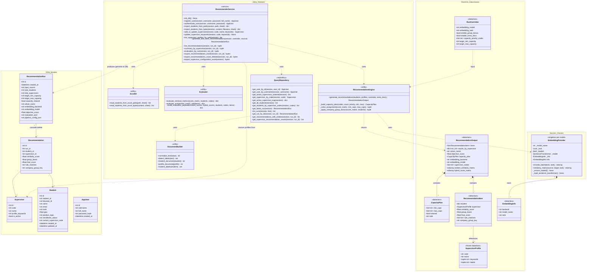

```mermaid
classDiagram
    direction TB

    namespace ORM_Models {
        class Supervisor {
            +int id
            +str code
            +str name
            +str profile_keywords
            +bool is_active
        }

        class Student {
            +int id
            +str student_id
            +str binusian_id
            +str name
            +str email
            +str track
            +float gpa
            +str position_topic
            +str enrollment_status
            +str current_supervisor_code
            +datetime created_at
            +datetime updated_at
        }

        class RecommendationRun {
            +int id
            +datetime created_at
            +str input_source
            +int total_students
            +int total_supervisors
            +int target_min_capacity
            +int target_max_capacity
            +bool capacity_relaxed
            +str solver_name
            +str embedding_backend
            +str embedding_model
            +float objective_score
            +str evaluation_json
            +str pipeline_config_json
        }

        class Recommendation {
            +int id
            +int run_id
            +int student_id
            +int supervisor_id
            +float similarity_score
            +float group_boost
            +float final_score
            +str rule_matches
            +str company_group_key
        }

        class AppUser {
            +int id
            +str username
            +str full_name
            +str password_hash
            +datetime created_at
        }
    }

    namespace Runtime_Dataclasses {
        class SupervisorProfile {
            <<frozen dataclass>>
            +str code
            +str name
            +tuple~str~ keywords
            +tuple~str~ labels
        }

        class RunOverrides {
            <<dataclass>>
            +str embedding_model
            +str embedding_task
            +bool enable_group_bonus
            +bool enable_extra_docs
            +list~str~ capacity_priority_codes
            +int target_min_capacity
            +int target_max_capacity
        }

        class CapacityPlan {
            <<dataclass>>
            +list~int~ min_caps
            +list~int~ max_caps
            +bool relaxed
            +str note
        }

        class RecommendationItem {
            <<dataclass>>
            +dict student
            +SupervisorProfile supervisor
            +float similarity_score
            +float group_boost
            +float final_score
            +list~str~ rule_matches
            +str company_group_key
        }

        class RecommendationOutput {
            <<dataclass>>
            +list~RecommendationItem~ items
            +dict~str_int~ counts_by_supervisor
            +str solver_name
            +float objective_score
            +CapacityPlan capacity_plan
            +str embedding_backend
            +str embedding_model
            +list~str~ supervisor_codes
            +ndarray content_similarity_matrix
            +ndarray hybrid_score_matrix
        }

        class EmbeddingInfo {
            <<dataclass>>
            +str backend
            +str model_name
            +str note
        }
    }

    namespace Service_Classes {
        class EmbeddingProvider {
            <<singleton per model>>
            -str _model_name
            -Lock _lock
            -bool _loaded
            -SentenceTransformer _model
            -EmbeddingInfo _info
            +EmbeddingInfo info
            +encode_batch(texts, task) ndarray
            +similarity_matrix(source, target, task) ndarray
            -_ensure_loaded() None
            -_load_sentence_transformer() None
        }
    }

    namespace Utility_Modules {
        class DocumentBuilder {
            <<utility>>
            +normalize_text(value) str
            +detect_labels(text) set
            +student_document(student) str
            +profile_document(profile) str
            +student_labels(student) set
        }

        class ExcelIO {
            <<utility>>
            +read_students_from_excel_path(path, sheet) list
            +read_students_from_excel_bytes(content, sheet) list
        }

        class Evaluator {
            <<utility>>
            +evaluate_retrieval_metrics(score_matrix, students, codes) dict
            +evaluate_assignment_match_rate(items) dict
            +build_evaluation_payload(content_scores, hybrid_scores, students, codes, items) dict
        }

        class RecommendationEngine {
            <<utility>>
            +generate_recommendations(students, profiles, overrides, extra_docs) RecommendationOutput
            -_build_capacity_plan(codes, count, priority, min, max) CapacityPlan
            -_solve_assignment(score_matrix, min_caps, max_caps) tuple
            -_apply_company_group_bonus(score_matrix, students) tuple
        }

        class QueryRepository {
            <<repository>>
            +get_user_by_id(session, user_id) AppUser
            +get_user_by_username(session, username) AppUser
            +get_active_supervisors_ordered(session) list
            +get_supervisor_by_code(session, code) Supervisor
            +get_active_supervisor_map(session) dict
            +get_all_students(session) list
            +get_students_by_supervisor_codes(session, codes) list
            +get_latest_run(session) RecommendationRun
            +list_runs(session, limit) list
            +get_run_by_id(session, run_id) RecommendationRun
            +get_recommendations_with_entities(session, run_id) list
            +get_supervisor_recommendation_counts(session, run_id) list
        }

        class RecommenderService {
            <<service>>
            +init_db() None
            +register_user(session, username, password, full_name) AppUser
            +authenticate_user(session, username, password) AppUser
            +import_students_from_path(session, path, sheet) dict
            +import_students_from_bytes(session, content, filename, sheet) dict
            +add_or_update_supervisor(session, code, name, keywords) Supervisor
            +update_supervisor_keywords(session, code, keywords) None
            +list_supervisor_profiles_for_web(session) list
            +generate_and_store_recommendations(session, overrides, source) RecommendationRun
            +list_recommendations(session, run_id) tuple
            +summary_by_supervisor(session, run_id) tuple
            +evaluation_by_run(session, run_id) tuple
            +export_recommendations_excel(session, run_id) bytes
            +export_recommendations_excel_detailed(session, run_id) bytes
            +export_supervisor_configuration_excel(session) bytes
        }
    }

    %% ── ORM Associations ──────────────────────────────────────────────
    RecommendationRun "1" --> "*" Recommendation : cascade delete
    Recommendation "*" --> "1" Student
    Recommendation "*" --> "1" Supervisor

    %% ── Runtime Composition ───────────────────────────────────────────
    RecommendationOutput "1" *-- "*" RecommendationItem : contains
    RecommendationOutput "1" *-- "1" CapacityPlan : contains
    RecommendationItem "*" --> "1" SupervisorProfile : references
    EmbeddingProvider "1" *-- "1" EmbeddingInfo : owns

    %% ── Service Dependencies (dashed uses arrows) ─────────────────────
    RecommenderService ..> RecommendationEngine : uses
    RecommenderService ..> QueryRepository : uses
    RecommenderService ..> ExcelIO : uses
    RecommenderService ..> Evaluator : uses
    RecommendationEngine ..> EmbeddingProvider : uses
    RecommendationEngine ..> DocumentBuilder : uses

    %% ── Data Flow ─────────────────────────────────────────────────────
    RunOverrides ..> RecommendationEngine : input
    RecommendationEngine ..> RecommendationOutput : returns
    RecommenderService ..> RecommendationRun : produces (persists to DB)
    RecommenderService ..> Supervisor : sources profiles from
```
